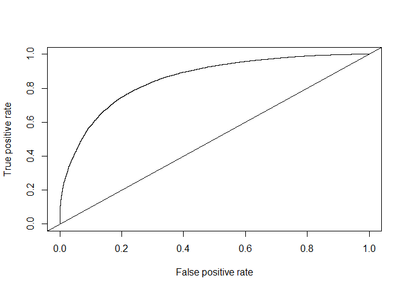

colorPredictor
================
Kevin Sweet
June 24, 2018

``` r
library(sigmoid)
library(png)
library(ROCR)
```

    ## Warning: package 'ROCR' was built under R version 3.4.4

    ## Loading required package: gplots

    ## Warning: package 'gplots' was built under R version 3.4.4

    ## 
    ## Attaching package: 'gplots'

    ## The following object is masked from 'package:stats':
    ## 
    ##     lowess

The goal of this project is to create a simple 3 layer neural network with back propagation that can predict the most legible text color (white or black) that contrasts with the background color. In doing so, I will learn the core mathematical principles that neural networks use and how to interpret the results using a ROC curve

Thank you to the youtuber Jabrils for the advice on using this as a learning tool: <https://www.youtube.com/watch?v=KO7W0Qq8yUE>

In order to make this example work, we need to generate our data to train and test the algorithm. To do this, I chose to use the color-yiq function that will output a white or black prediction given a color.

0 -&gt; Black 1 -&gt; White

``` r
yiqCalc <- function(rgbmatrix){
  
  r <- rgbmatrix[1,1,1] * 255 
  g <- rgbmatrix[1,1,2] * 255
  b <- rgbmatrix[1,1,3] * 255
  
  yiq <- (r*299 + g*587 + b*114)/1000
  
  return(if(yiq >= 128) 0 else 1)
  
}
```

Here is the function that will generate our 10x10 pixel images of a single color

``` r
imageGenerator <- function(numofImages){
  l <- list()
  for(i in 1:numofImages){
    image <- array(NA, c(10,10,3))
    image[,,1] <- runif(1,min = 0, max = 1)
    image[,,2] <- runif(1,min = 0, max = 1)
    image[,,3] <- runif(1,min = 0, max = 1)
    l[[i]] <- image
  }
  
  return(l)
  
}
```

Here is the function to calculate the output of our neural network

``` r
prdictNN <- function(wghts,b,clrdimg){
    z <- clrdimg[1,1,1]*wghts[1]+clrdimg[1,1,2]*wghts[2]+clrdimg[1,1,3]*wghts[3]+b
    return(sigmoid(z))
}
```

Main:

``` r
  #Define constants
  NUM_TRAINPOINTS <- 10000
  NUM_TESTPOINTS <- 2000
  NUM_EPOCHS <- 50000
  LEARN_RATE <- 0.3
  
  
  #generate test/train images
  ltrain <- imageGenerator(NUM_TRAINPOINTS)
  ltest <- imageGenerator(NUM_TESTPOINTS)
  
  #generate output of yiq function (function we will be training NN to) for train and test set
  lyiqtrain <- array(NA,dim = length(ltrain))
  lyiqtest <- array(NA,dim = length(ltest))
  for(i in 1:length(ltrain)){
    lyiqtrain[i] <- yiqCalc(ltrain[[i]])
    if(i<=NUM_TESTPOINTS){
      lyiqtest[i] <- yiqCalc(ltest[[i]])
    }
  }
  
  #initialize neural network weights and bias
  wghts <- rnorm(3)
  b <- rnorm(1)
  
  #train 
  for(i in 1:NUM_EPOCHS){
    r_indx <- runif(1,min = 1,max = NUM_TESTPOINTS)
    selPoint <- ltrain[[r_indx]]
    target <- lyiqtrain[[r_indx]]
    
    #feed forward
    pred <- prdictNN(wghts,b,selPoint)
    
    cost <- (pred - target)^2
    
    dcost_dpred <- 2 * (pred - target)
    
    #d/dz sigmoid z = sigmoid(z)*(1-sigmoid(z))
    dpred_dz <- pred * 1-pred
    
    #how does z change with respect to the weights and b?
    dz_dw1 <- selPoint[1,1,1]
    dz_dw2 <- selPoint[1,1,2]
    dz_dw3 <- selPoint[1,1,3]
    dz_db <- 1
    
    #now we can get the partial derivatives using the chain rule
    #We are bringing how the cost changes through each function, first through the square, then through the sigmoid
    #and finally whatever is multiplying our parameter of interest becomes the last past
    dcost_dw1 <- dcost_dpred * dpred_dz * dz_dw1
    dcost_dw2 <- dcost_dpred * dpred_dz * dz_dw2
    dcost_dw3 <- dcost_dpred * dpred_dz * dz_dw3
    dcost_db <- dcost_dpred * dpred_dz * dz_db
    
    
    #update parameters
    wghts[1] <- wghts[1] - LEARN_RATE*dcost_dw1
    wghts[2] <- wghts[2] - LEARN_RATE*dcost_dw2
    wghts[3] <- wghts[3] - LEARN_RATE*dcost_dw3
    b <- b - LEARN_RATE*dcost_db
  }

  
  #test
  pred <- array(NA,dim = length(ltest))
  for(i in 1:NUM_TESTPOINTS){
    pred[i] <- prdictNN(wghts,b,ltest[[i]])
  }
  
  #results
  rocprod <- prediction(as.numeric(pred),as.numeric(lyiqtest))
  roc.perf <-  performance(rocprod, measure = "tpr", x.measure = "fpr")
  auc.perf <- performance(rocprod, measure = "auc")
  
  {plot(roc.perf)
  abline(a=0, b = 1)}
```



``` r
  print(paste("AUC:", auc.perf@y.values))
```

    ## [1] "AUC: 0.893153999999999"
